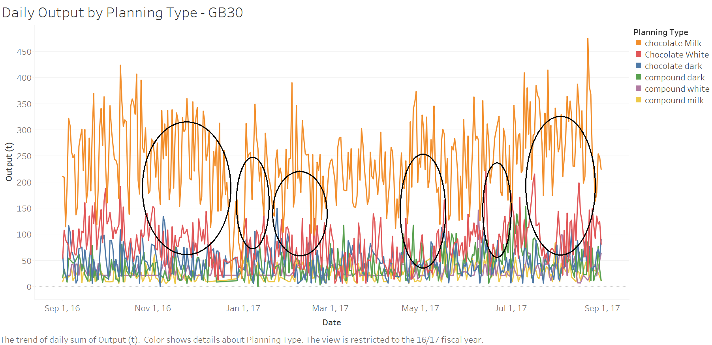
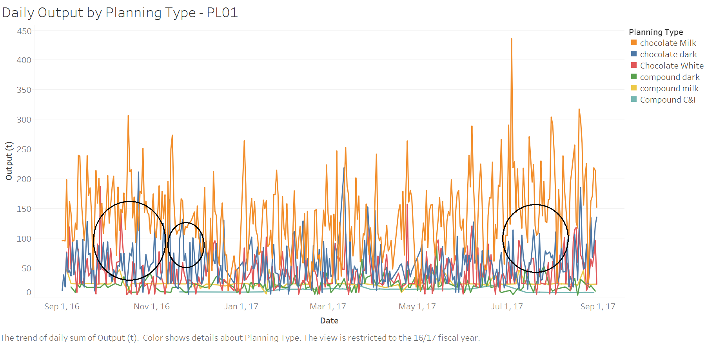
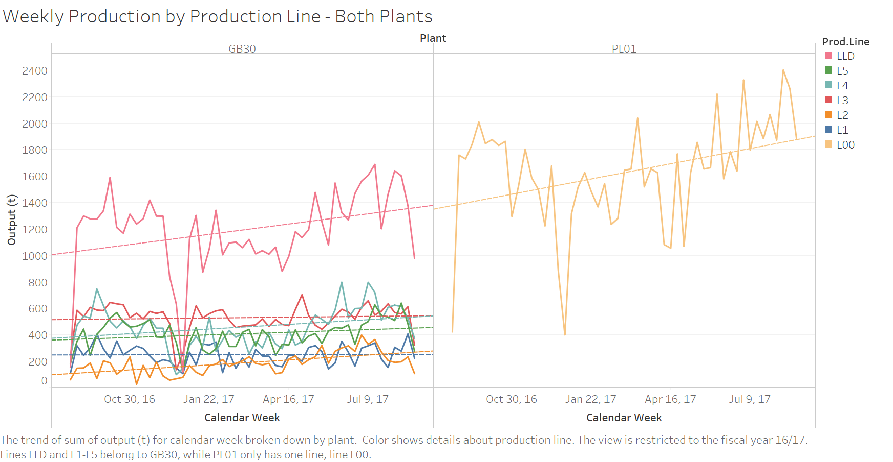
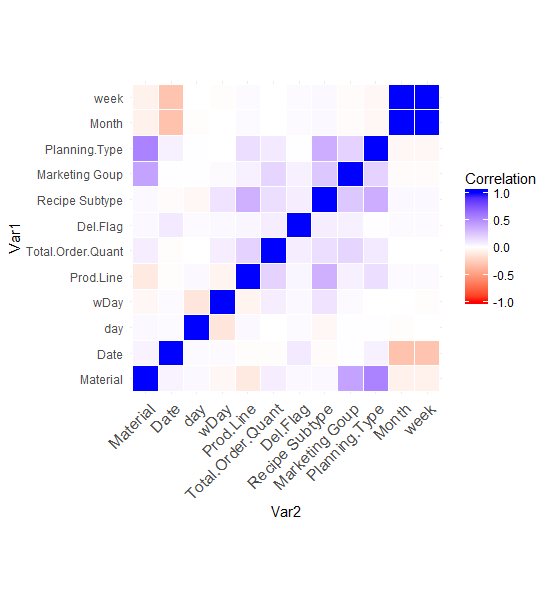
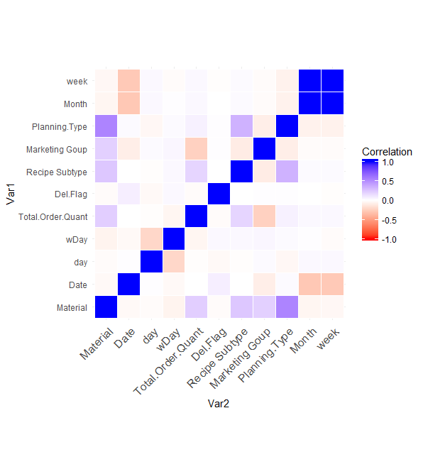

# Chocolate Production and Growth Feasibility
Working with a reduced set of an original 350,000 chocolate production observations, I reviewed production for seasonal patterns and interesting behaviors, in order to better understand the overall production of two seperate chocolate plants in Europe. The results of this analysis was then used by company partners to refine production methods and determine growth feasibility for the two plants I analyzed, the plants analyzed by other members of the team, and a future plants.

## General Overview
Analysis for this project was conducted both in R and Tableau. The original data set was reduced and cleaned in the 'AdvProj-Chocolate.R' file, and this is where the data set used in Tableau was produced.

The initial data set of over 350,000 observations was reduced to a set containing only the plants which I was tasked with analyzing: Plants PL01 and GB30. I reviewed the data for these plants, imputed missing values, and created various new varibles describing the production date information. I then merged this data with other files I was provided so that I could include information on the planning type (what type of chocolate product was being produced) with the general order information, and reviewed the resulting data for seasonal patterns.
The following Tableau plots show the daily output of the two plants (GB30 and PL01, respectively) for each planning type they produce.

Both plants produce milk chocolate at a vast majority over the other planning types. At multiple times throughout the year, the production of milk chocolate increases a the same time that other planning type productions decrease; these periods are marked with black circles in the above plots.

Both plants saw a marked increase in the weekly production of their most used lines from 2016 to 2017. There was also, for both plants, a very clear decrease in production around christmas, when the plants close down for the holidays.

  
  

The left correlation plot shows the pairwise correlations for plant GB30, and the right shows the pairwise correlations for PL01. Both plots show notable negative correlations between the Planning type and the Material and the Recipe Subtype as well as the Marketing Group and the Material. There are far more negative correlations between the variables of plant GB30 than there are for plant PL01.

## Requirements and Data
As the data used in this analysis is entirely proprietary, I will not be releasing it here, nor can I provide any information on how to download it. As such, there is no possibility of someone running the code files found here on their local machine. The libraries used in the analysis can be found in the `AdvProj-Chocolate.R` file, under the "libraries" header.
